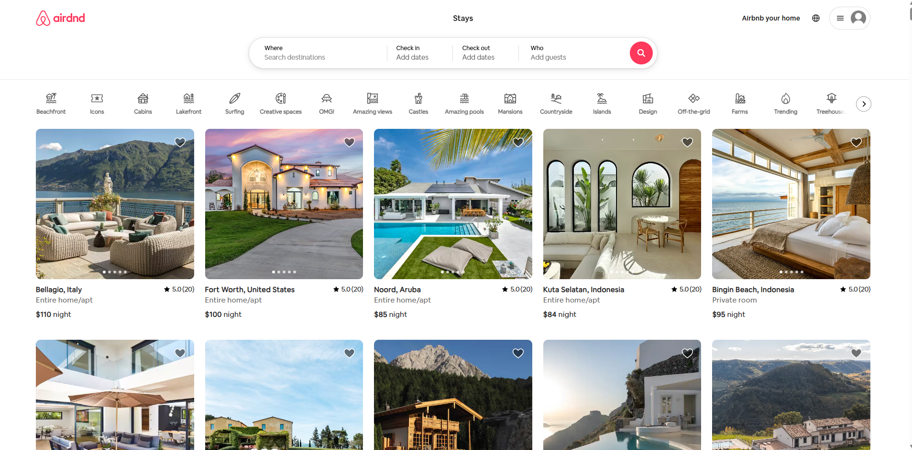
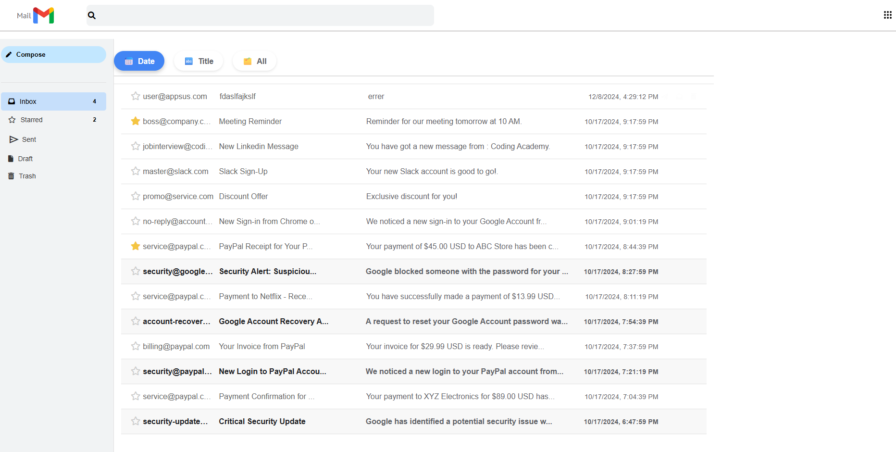

<!-- Greeting -->
<h1 align="center">Hi 👋, I'm Eran!</h1>

---

### 🙋‍♂️ About Me
I'm a **Full Stack Developer** with a passion for building modern web applications.  
I specialize in both frontend and backend development, using a variety of technologies to create scalable and efficient solutions.

- 💻 Skilled in **JavaScript, HTML, CSS**, and frameworks like **React.js, Next.js.**  
- ⚡ Backend expertise in **Node.js, REST APIs, and Sockets**  
- 📚 Continuously learning with a focus on **impact and quality**  

---

### ✨ Highlights
- 🎯 Completed frontend and backend training at **Coding Academy**
- 🌱 Always exploring **new tech and best practices**

---

### 🛠 Technology & Tools

  
  
  
  
  
  

---

### 📫 Contact Me
- 📧 Email: **EranYosefHD@gmail.com**  
- 💼 [LinkedIn](https://www.linkedin.com/in/eran-yosef-544b21332//)  

---

### 📂 My Projects

 Airdnd, Inspired by Airbnb. (Make sure to sign up/use demo login to make the full functionality work)

 

 Mail, Inspired by Gmail.

Portfolio – Personal portfolio site built with Next.js, React, and Tailwind CSS.

